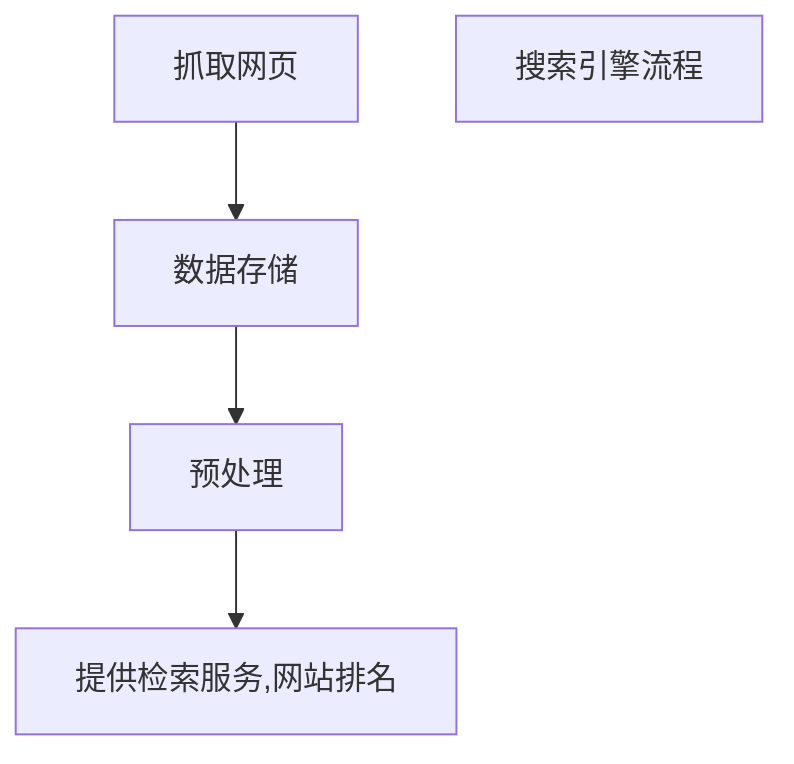
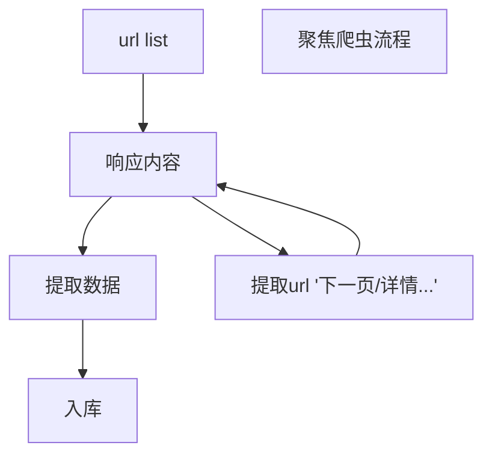

> 数据：国家统计局官网|环球网
> 微信公众号合作方：https://weixin.sogou.com/
> 百度搜索资源平台：https://ziyuan.baidu.com/robots/index
> json在线解析: https://www.bejson.com/

---
python安装第三方模块
- pip install 
- 源码包
  下载源码包 -- 解压缩源码包 -- `python setup.py install`
- `***.whl` 安装 `pip install ***.whl`

## 一、通用爬虫模块
- [x] 模拟浏览器发送请求
- [x] 爬虫更多用途：
- 12306抢票|
- 网站上的投票|
- 短信轰炸

### 爬虫的流程
- [x] 爬虫分类：
- 通用爬虫：通常指搜索引擎爬虫
- 聚焦爬虫：针对特定网站爬虫 `重点关注`

#### 通用搜索引擎工作原理

---

### 搜索引擎的工作原理及robots协议
[爬虫介绍](https://www.jianshu.com/p/2c7d47a50332?utm_campaign=maleskine&utm_content=note&utm_medium=seo_notes&utm_source=recommendation)
`种子URL`
`robots协议`:当前网站的根目录下面有个 robots.txt  文件

### 了解浏览器发送请求的流程
爬虫要根据当前url对应的响应为准，当前url地址的elements的内容和url的响应不一样
`浏览器渲染出来的页面和爬虫请求的页面是不一样的`
问：页面上的数据在哪里？
- 当前url地址对应的响应中
- 其他的url地址对应的响应中
  - ajax 请求中
- js生成的
  - 部分数据在响应中
  - 全部js生成
#### URL的形式
形式 scheme://host[:port]/path/.../[?query-string][#amchor]

scheme 协议(eg:http、https、ftp)
host 服务器的Ip地址或域名
port 服务器的端口（如果是走协议默认端口，80 or 443)
path 访问资源的路径
query-string 参数，发送给http服务器的数据
amchor 锚点(跳转到网页指定锚点位置)

#### HTTP 常见的请求头
HOST 主机和端口号
Connection 链接类型
Upgrade-Insecure-Requests 升级为HTTPS请求
User_Agent 浏览器名称
Accept 传输文件类型
Referer 页面跳转处
Accept-Encoding 文件编码格式
Cookie
x-requested-with:XMLHttpRequest(是Ajax异步请求)

#### 常见状态码详解
[链接](https://blog.csdn.net/w19981225/article/details/110088516)

#### 字符串类型的区别和转化
bytes:二进制（互联网上的数据都是以二进制的数据传输的）
str:unicode的形式展现

encode
decode

#### 字符串格式化方式
`"啦啦啦{}kdlkf{}".format("你好啊")`
`% 方式`

url = 'https://www.baidu.com/s?wd={}'.format("查询")
### 爬虫 requests 库
当我们使用 Requests 模块向一个 URL 发起请求后会返回一个 HttpResponse 响应对象，该对象具有以下常用属性：

|常用属性|说明|
|--|--|
|encoding|查看或指定响应对象的字符编码|
|status_code|返回HTTP响应码|
|url|查看请求的url地址|
|headers|查看请求头信息|
|cookies|查看cookies信息|
|text|以字符串形式输出|
|content|以字节流形式输出，若保存下载图片需要使用该属性|

Requests 库中定义了七个常用的请求方法，这些方法各自有着不同的作用，在这些请求方法中 requests.get() 与 requests.post() 方法最为常用。请求方法如下所示：

| 方法	|说明|
|--|--|
| requests.request()|构造一个请求对象，该方法是实现以下各个方法的基础。|
| requests.get()	|获取HTML网页的主要方法，对应于 HTTP 的 GET 方法。|
| requests.head()	|获取HTML网页头信息的方法，对应于 HTTP 的 HEAD 方法。|
| requests.post()	|获取 HTML 网页提交 POST请求方法，对应于 HTTP 的 POST。|
| requests.put()	|获取HTML网页提交PUT请求方法，对应于 HTTP 的 PUT。|
| requests.patch()	|获取HTML网页提交局部修改请求，对应于 HTTP 的 PATCH。|
| requests.delete()	|获取HTML页面提交删除请求，对应于 HTTP 的 DELETE。|


```py
# coding=utf-8
import requests

kw = input("enter a word:")
headers = {
    'User-Agent': 'Mozilla/5.0 (Windows NT 6.1; Win64; x64) AppleWebKit/537.36 (KHTML, like Gecko) Chrome/86.0.4240.75 Safari/537.36'
}

p = {
    'wd': kw
}
url = 'https://www.baidu.com/s?'

response = requests.get(url=url, params=p, headers=headers)

# print(response.text)

print(response.status_code)
print(response.headers)
print(response.request)
print(response.request.headers)
print(response.content)
```
#### 贴吧爬虫
[github]()
#### request模块发送post请求
```py
import requests

headers = {
    "User-Agent": "Mozilla/5.0 (iPhone; CPU iPhone OS 13_2_3 like Mac OS X) AppleWebKit/605.1.15 (KHTML, like Gecko) Version/13.0.3 Mobile/15E148 Safari/604.1"
}
post_data = {
  "form":"en",
  "to":"zh",
  "query":"人生苦短"
}
post_url = "https://fanyi.baidu.com/v2transapi"
r=requests.post(post_url,data=post_data,headers=headers)
```
#### requests模块使用代理

- 用法：requests.get(url,proxies = proxies,headers=headers)
	proxies 的形式:字典
	
	proxies = {
	  "http":"",
	  "https":""
	}
- 注意
  - 准备一堆的ip地址，组成ip池，随机选择一个IP来用
  - 如何随机选择代理IP
    - {"ip":ip,"times":0}
    - [{},{},{},{},{}] 对这个ip列表进行排序，按照使用次数进行排序
    - 选择较少的使用次数的10个IP，从中随机选择一个
  - 检查ip的可用性
    - 可以使用 request 添加超时参数，判断ip质量
    - 在线代理ip检测网站

- 问：为什么爬虫需要代理？
  1. 让服务器以为不是同一个客户端请求
  2. 防止我们的真实地址被披露，防止被追究

- 代理
  > [米扑代理]https://proxy.mimvp.com/
  > [码农很忙]https://www.coderbusy.com/archives/2616.html

#### requests 模拟登录的三种方式
requests 提供了一个叫做session类，来实现客户端和服务端的`会话保持`
  session = requests.session()
  response = session.get(post_url,headers=headers)

> 获取登录后页面的三种方式
> - 实例化 session,使用session发送post请求，再使用他获取登录后的页面
> - headers 中添加cookie键，值为cookie字符串
> - 在请求方法中添加cookies参数，接收字典形式的cookie，字典形式的cookie中的键式cookie的name对应的值，value是 cookie value的值

`手动尝试使用session来登录人人网 ： http://www.renren.com/Plogin.do`

1. 携带cookie请求
- 携带cookie进行请求，把cookie组成cookie池

2. 使用requests请求登录之后的网站的思路
- 实力化session
- 先使用session发送请求，登录网站，把cookie保存在session中
- 在使用session请求登录之后才能访问的网站，session能勾自动携带登录成功时保存在其中的cookie进行请求

```py
import requests
post_url = ""
headers = {
  'User-Agent': 'Mozilla/5.0 (Windows NT 6.1; Win64; x64) AppleWebKit/537.36 (KHTML, like Gecko) Chrome/86.0.4240.75 Safari/537.36'
}
post_data = {}

session = requests.session()
session.post(post_url,data=post_data,headers=headers)
session.get(post_url,headers=headers)
```

3. 不发送post请求，使用cookie获取登录后的页面
- cookies 过期时间很长
- 在cookie过期之前能够拿到所有的数据，比较麻烦
- 配合其他程序一起使用，其他程序专门获取cookie，当前程序专门请求页面
```
url = ""
headers = {
  'User-Agent': 'Mozilla/5.0 (Windows NT 6.1; Win64; x64) AppleWebKit/537.36 (KHTML, like Gecko) Chrome/86.0.4240.75 Safari/537.36',
  'Cookie':''
}
requests.get(url=url, headers=headers)
```
> 字典推导式，列表推导式
```py
# 字典
cookies="PSTM=1605247706; BIDUPSID=4453E13A228BDA1DB2E813221E502E36; __yjs_duid=1_a9f37727459fde17b5309351fa92907b1618563331437; BDUSS=0ySXhkZ0VZYk44Sm5icVRaWHd5M3BNV1NlYzdKTHhqZmVKNjlhdnBkbzI1S0JnRVFBQUFBJCQAAAAAAAAAAAEAAAA-rzyWenp6d3d3OTk4AAAAAAAAAAAAAAAAAAAAAAAAAAAAAAAAAAAAAAAAAAAAAAAAAAAAAAAAAAAAAAAAAAAAAAAAADZXeWA2V3lgQS; "
cookies={i.split("=")[0]:i.split("=")[1] for i in cookies.split("; ")}
url = ""
headers = {
  'User-Agent': 'Mozilla/5.0 (Windows NT 6.1; Win64; x64) AppleWebKit/537.36 (KHTML, like Gecko) Chrome/86.0.4240.75 Safari/537.36'
}
requests.get(url, headers=headers,cookies=cookies)
```
```py
# 列表
[self.url.format(i+50) for i in range(1000)]
```
#### requests 模块发送请求和获取网页的字符串[中解决编解码的方法]
pip install requests 
pip --version 查看版本号

- request 中解决编解码的方法
response.content.decode()
response.content.decode('gbk')
response.text

### request 小技巧
1. requests.util.dict_from_cookiejar 把cookie对象转化为字典
2. url 编码解码
   requests.util.quote
   requests.util.unquote
3. 请求SSL证书验证
  response = requests.get("https://www.12306.cn/mormhweb/",verify=False)
4. 设置超时
  response = requests.get(url,timeout=10)
5. 配合状态码判断是否请求成功
  assert response.status_code == 200

6. pip install retrying
  装饰器的方式使用：执行3次，程序报错
  @retry(stop_max_attemp_number=3)

### 爬虫数据 - json数据
#### 数据分类
- 结构化数据 json、xml : 处理方法转化为 python 数据类型
- 非结构化数据 html : 处理方法正则表达式/xpath

#### json模块学习
> JSON（javascript object notation）轻量级的数据交换格式

问：哪里找到返回json的URL？
   1. chrome切换到手机版
   2. 抓包手机app的软件
  
```py
import json 

# 将 Python 对象编码成 JSON 字符串
json.dumps(obj, skipkeys=False, ensure_ascii=True, check_circular=True, allow_nan=True, cls=None, indent=None, separators=None, encoding="utf-8", default=None, sort_keys=False, **kw)

# 将已编码的 JSON 字符串解码为 Python 对象
json.loads(s[, encoding[, cls[, object_hook[, parse_float[, parse_int[, parse_constant[, object_pairs_hook[, **kw]]]]]]]])
```

json中字符串都是双引号
: 如果不是双引号
  : eval ：能实现简单的字符串和python类型的转换
  : replace ：把单引号转换为双引号

#### 数据提取
json字符串
: json_loads()
: json_dumps()

包含json的类文件对象
: json.load()
: json.dump()

注:只有read()或者write()方法的对象就是类文件对象
f=open("json.txt","r") f 就是类文件对象

抓取 : https://36kr.com/

-  往一个文件中写入多个json串，不再是一个json,不能直接读取
   - 一行写一个json按照行来读取

### 正则处理数据[regular expression]
>[正则表达式基础](https://blog.csdn.net/m0_38144883/article/details/126489009)
#### 正则和原始字符串 r
常用正则表达式的方法：
: re.compile(编译)
: pattern.match(从头找一个)  
: pattern.search(找一个)
: pattern.findall(找所有) ` re.findall(".","\n",re.S)`  `re.S 等价 re.DOTALL`
  `不分组时匹配的是全部，分组后匹配的是组内内容`
: pattern.sub(替换)
#### `r` 的使用
- 忽略转译字符带来的转译的影响
r"a\nb" == "a\nb" False
re.findall("a\nb","a\nb")
re.findall(r"a\nb","a\nb")
re.findall("a\nb","a\\nb")

- windows 下不使用原始字符串会出现问题
  r'D:\my\soft\'

#### 正则使用的注意点
- re.findall("a(.*?)b","str") 能够返回括号中的内容,括号前后的内容起到定位和过滤的效果
- 原始字符串 `r`,待匹配字符串中有反斜杠的时候，使用它能够忽视反斜杠带来的转译效果
- 点号默认情况匹配不到 `\n`
- `\s`能够匹配空白字符，不仅仅包含空格，还有`\t|\r\n`

### xpath处理数据
> [菜鸟教程](https://www.runoob.com/xpath/xpath-syntax.html)
#### xml 了解
XPATH和LXML类库
http://www.w3school.com.cn/xpath/index.asp

|数据格式|描述|设计目标|
|:---:|:---:|:---:|
|xml|EXtensible Markup Language(可扩展标记语言)|被设计为传输和存储数据，其焦点是数据的内容|
|HTML|HyperText Markup Language(超文本标记语言)|显示数据以及如何更好的显示数据|
```xml
<book> parent
  <title></title> children
  <author></author> sibling
  <year></year> Ancestor
  <price></price> Descendant
</book>
```
工具
: google 插件 XPath Helper
: 开源Xpath表达式编辑工具：XMLQuire(XML文件格式可用)
: Firefox 插件 XPath Checker

#### xpath学习重点
1. 获取文本 
   - `a/text()` 获取a下的文本
   - `a//text()` 获取a下所有标签的文本
   - `//a[text()=='下一页']` 选择文本下一页为三个字的a标签
2. `@`
   - `a/@href`  获取属性
   - `//url[@id="detail-list"]`
3. `//`
   - 在xpath开始的时候表示从当前html中任意位置开始选择
   - `li//a` 表示的是li下任何一个标签

*** `注意：使用xpath helper 或者是 chrome 中的 copy xpath 都是从element中提取的数据，但爬虫获取的是url对应的响应，往往和 elements不一样` ***

#### xpath 小结
- [x] 路径表达式

  |表达式|描述|
  |:---|:---|
  |node_name|选取此节点的所有子节点|
  |/|绝对路径匹配，从根节点选取。|
  |//|相对路径匹配，从所有节点中查找当前选择的节点，包括子节点和后代节点，其第一个 / 表示根节点|
  |.|选取当前节点|
  |..|选取当前节点的父节点|
  |@|选取属性值，通过属性值选取数据。常用元素属性有@id、@name、@type、@class、@title、@href|
  > 注意：当需要查找某个特定的节点或者选取节点中包含的指定值时需要使用[]方括号。如下所示：

- [x] xpath 通配符
  |通配符|描述说明|
  |:---|:---|
  |*|匹配任意元素节点|
  |@*|匹配任意属性节点|
  |node()|匹配任意类型的节点|

- [x] xpath 内建函数 
> Xpath 提供 100 多个内建函数，这些函数给我们提供了很多便利，比如实现文本匹配、模糊匹配、以及位置匹配等，下面介绍几个常用的内建函数。
>
> 想要了解更多关于 Xpath 的知识可访问官方网站：https://www.w3.org/TR/xpath/

|函数名称|xpath表达式示例|示例说明|
|:---:|:---:|:---:|
|text()|./text()|文本匹配，表示值取当前节点中的文本内容|
|contains()|//div[contains[@id,'stu']|模糊匹配，表示id中包含"stu"的所有div节点|
|last()|//*[@class='web'][last()]|位置匹配，表示选择@class='web'的最后一个节点|
|position()|//*[@class='site'][position()<=2]|位置匹配，表示选择@class='site'的前两个节点。|
|start-with()|"//input[start-with(@id,'st')]"	|匹配 id 以 st 开头的元素。|
|ends-with()|"//input[ends-with(@id,'st')]"	|匹配 id 以 st 结尾的元素。|
|concat(string1,string2)|concat('C语言中文网',.//*[@class='stie']/@href)	|C语言中文与标签类别属性为"stie"的 href 地址做拼接。|

#### lxml 库
> pip install lxml

- 使用流程
```
1）导入模块
2）创建解析对象
3）调用 xpath 表达式

from lxml import etree
# 创建解析对象
parse_html=etree.HTML(html)
# 书写xpath表达式,提取文本最终使用text()
xpath_bds='//a/text()'
# 提取文本数据，以列表形式输出
r_list=parse_html.xpath(xpath_bds)
# 打印数据列表
print(r_list)
```

- 使用入门
  - 导入lxml的etree库
  from lxml import etree
  - 利用etree.HTML,将字符串转化为Element对象
  - Element对象具有xpath的方法
  html=etree.HTML(text)

- lxml可以自动修正 html代码

- lxml能够接受bytes和str的字符串

- 提取页面数据的思路
  - 先分组
  - 遍历，取其中每一组进行数据的提取，不会造成数据的对应错乱

### 通用爬虫案例
### 爬取动态html数据
### 豆瓣登录案例
### 斗鱼爬虫

---
反爬虫一些技巧：
- 1. 定义 User-Agent 


技巧
### 自定义UA（User-Agent）代理池
- [x] 自己构建
```py
# ua_info.py
ua_list = [
    'Mozilla/4.0 (compatible; MSIE 7.0; Windows NT 5.1; Maxthon 2.0',
    'Mozilla/5.0 (Macintosh; Intel Mac OS X 10_7_0) AppleWebKit/535.11 (KHTML, like Gecko) Chrome/17.0.963.56 Safari/535.11',
    'User-Agent:Opera/9.80 (Windows NT 6.1; U; en) Presto/2.8.131 Version/11.11',
    'Mozilla/5.0 (Windows NT 6.1; rv:2.0.1) Gecko/20100101 Firefox/4.0.1',
    'Mozilla/4.0 (compatible; MSIE 7.0; Windows NT 6.0)',
    'Mozilla/5.0 (Windows; U; Windows NT 6.1; en-us) AppleWebKit/534.50 (KHTML, like Gecko) Version/5.1 Safari/534.50',
    'Mozilla/5.0 (compatible; MSIE 9.0; Windows NT 6.1; Trident/5.0',
    ' Mozilla/4.0 (compatible; MSIE 7.0; Windows NT 5.1',
    'Mozilla/4.0 (compatible; MSIE 6.0; Windows NT 5.1',
    ' Mozilla/5.0 (Macintosh; Intel Mac OS X 10.6; rv:2.0.1) Gecko/20100101 Firefox/4.0.1',
]
```
- [x] 第三方构建
> 您也可以使用专门第三方的模块来随机获取浏览器 UA 信息，不过该模块需要单独安装，安装方式如下：
`pip install fake-useragent`
```py 
from fake_useragent import UserAgent
#实例化一个对象
ua=UserAgent()
#随机获取一个ie浏览器ua
print(ua.ie)
print(ua.ie)
#随机获取一个火狐浏览器ua
print(ua.firefox)
print(ua.firefox)
```
### 爬虫程序结构
```py
# 程序结构
class xxxSpider(object):
    def __init__(self):
        # 定义常用变量,比如url或计数变量等
       
    def get_html(self):
        # 获取响应内容函数,使用随机User-Agent
   
    def parse_html(self):
        # 使用正则表达式来解析页面，提取数据
   
    def write_html(self):
        # 将提取的数据按要求保存，csv、MySQL数据库等
       
    def run(self):
        # 主函数，用来控制整体逻辑
       
if __name__ == '__main__':
    # 程序开始运行时间
    spider = xxxSpider()
    spider.run()
```
### python爬虫忽略ssl证书验证问题
```py
# 1. 导入Python SSL处理模块
import ssl

# 2. 表示忽略未经核实的SSL证书认证
context = ssl._create_unverified_context()
......
# 3. 在urlopen()方法里 指明添加 context 参数
response = urllib2.urlopen(request, context = context)
```
### SSL认证-verify参数
response = requests.get(
  url=url,
  params=params,
  headers=headers,
  verify=False
)

### 代理IP-proxies参数
> 插件[http://c.biancheng.net/python_spider/switchyomega.html]
一些网站为了限制爬虫从而设置了很多反爬策略，其中一项就是针对 IP 地址设置的。比如，访问网站超过规定次数导致流量异常，或者某个时间段内频繁地更换浏览器访问，存在上述行为的 IP 极有可能被网站封杀掉。

代理 IP 就是解决上述问题的，它突破了 IP 地址的访问限制，隐藏了本地网络的真实 IP，而使用第三方 IP 代替自己去访问网站。
1) 代理IP池
通过构建代理 IP 池可以让你编写的爬虫程序更加稳定，从 IP 池中随机选择一个 IP 去访问网站，而不使用固定的真实 IP。总之将爬虫程序伪装的越像人，它就越不容易被网站封杀。当然代理 IP 也不是完全不能被察觉，通过端口探测技等术识仍然可以辨别。其实爬虫与反爬虫永远相互斗争的，就看谁的技术更加厉害。
2) proxies参数
Requests 提供了一个代理 IP 参数proxies，该参数的语法结构如下：
proxies = {
      '协议类型(http/https)':'协议类型://IP地址:端口号'
    }
下面构建了两个协议版本的代理 IP，示例如下：
proxies = {
   'http':'http://IP:端口号',
   'https':'https://IP:端口号'
}
3) 代理IP使用
下面通过简单演示如何使用proxies参数，示例如下：
```py
import requests
​
url = 'http://httpbin.org/get'
headers = {
    'User-Agent':'Mozilla/5.0'
}
# 网上找的免费代理ip
proxies = {
    'http':'http://191.231.62.142:8000',
    'https':'https://191.231.62.142:8000'
}
html = requests.get(url,proxies=proxies,headers=headers,timeout=5).text
print(html)
```
```
输出结果：
{
  "args": {},
  "headers": {
    "Accept": "*/*",
    "Accept-Encoding": "gzip, deflate",
    "Cache-Control": "max-age=259200",
    "Host": "httpbin.org",
    "User-Agent": "Mozilla/5.0",
    "X-Amzn-Trace-Id": "Root=1-605073b0-4f54db1b2d2cfc0c074a1193"
  },

  # 注意此处显示两个IP，第一个是你自己的真实IP，另外一个是对外展示的IP
  "origin": "121.17.25.194, 191.235.72.144", 
  "url": "http://httpbin.org/get"
}
```
由于上述示例使用的是免费代理 IP，因此其质量、稳定性较差，可能会随时失效。如果想构建一个稳定的代理 IP 池，就需要花费成本。
4) 付费代理IP
网上有许多提供代理 IP 服务的网 站，比如快代理、代理精灵、齐云代理等。这些网站也提供了相关文档说明，以及 API 接口，爬虫程序通过访问 API 接口，就可以构建自己的代理 IP 池。

- [x] 付费代理 IP 按照资源类型可划分为：开发代理、私密代理、隧道代理、独享代理，其中最常使用的是开放代理与私密代理。

- [x] 开放代理：开放代理是从公网收集的代理服务器，具有 IP 数量大，使用成本低的特点，全年超过 80% 的时间都能有 3000 个以上的代理 IP 可供提取使用。

- [x] 私密代理：私密代理是基于云主机构建的高品质代理服务器，为您提供高速、可信赖的网络代理服务。私密代理每天可用 IP 数量超过 20 万个，可用率在 95 %以上，1 次可提取 IP 数量超过 700 个，可以为爬虫业务提供强大的助力。

付费代理的收费标准根据 IP 使用的时间长短，以及 IP 的质量高低，从几元到几百元不等。89 免费代理（http://www.89ip.cn/）是一个专门提供免费代理 IP 的网站，不过想找到一个质量较高的免费代理好比大海捞针。


### 用户认证-auth参数
Requests 提供了一个auth参数，该参数的支持用户认证功能，也就是适合那些需要验证用户名、密码的网站。auth 的参数形式是一个元组，其格式如下：
`auth = ('username','password')`

```py
class xxxSpider(object):
  def __init__(self):
    self.url = 'http://code.tarena.com.cn/AIDCode/aid1906/13Redis/'
    # 网站使用的用户名，密码
    self.auth = ('name','******')
​
  def get_headers(self):
      headers = {'User-Agent':"Mozilla/5.0"}
      return headers
​
  def get_html(self,url):
      res = requests.get(url,headers=self.get_headers(),auth=self.auth)
      html = res.content
      return html
...
```


### 


### 爬虫程序随机休眠
- [x] 每爬取一个页面随机休眠1-2秒钟的时间
`time.sleep(random.randint(1,2))`

### 怎么查看网页是静态页还是伪静态？
怎么查看网页是静态页还是伪静态？
现在很多浏览器都禁止执行：javascript:alert(document.lastModified)
可以在调式模式中执行。以火狐浏览器为例。
打开目标网页，等加载完成。按F12键调出控制台，在底部就可以输入：javascript:alert(document.lastModified)然后回车。第一次执行为提示有风险，然后要你输入它提示的英文。按提示输入完。再执行上面的代码就可以了。
伪静态时间不一致。
静态时间一致。

### 多线程爬虫
网络爬虫是一种IO密集型程序，程序中涉及了很多网络IO操作，这些都会消耗大量的时间，
从而降低程序的执行效率，而 python 提供多线程能够在一定程度上提升 IO 密集型程序的执行效率。
> Python 提供了两个支持多线程的模块，分别是 _thread 和 threading。其中 _thread 模块偏底层，它相比于 threading 模块功能有限，因此推荐大家使用 threading 模块。 threading 中不仅包含了  _thread 模块中的所有方法，还提供了一些其他方法，如下所示：
threading.currentThread() 返回当前的线程变量。
threading.enumerate() 返回一个所有正在运行的线程的列表。
threading.activeCount() 返回正在运行的线程数量。

```
### 线程的具体使用方法
from threading import Thread
#线程的创建、启动、回收
t=Thread(target=函数名) # 创建线程对象
t.start() # 创建并启动线程
t.join() # 阻塞等待回收线程

### 创建多线程的具体流程
t_list=[]
for i in range(5):
  t=Thread(target=函数名)
  t_list.append(t)
  t.start()

for t in t_list:
  t.join()

### 在处理线程的过程中要时刻注意线程的同步问题，
    即多个线程不能操作同一个数据，否则会造成数据的不确定性。
    通过 threading 模块的 Lock 对象能够保证数据的正确性。

比如，使用多线程将抓取数据写入磁盘文件，此时，就要对执行写入操作的线程加锁，这样才能够避免写入的数据被覆盖。当线程执行完写操作后会主动释放锁，继续让其他线程去获取锁，周而复始，直到所有写操作执行完毕。具体方法如下所示：
from threading import Lock
lock=Lock()
#获取锁
lock.acquire()
wirter.writerrows("线程锁问题解决")
#释放锁
lock.release() 
```

### Queue队列模型
对于 Python 多线程而言，由于 GIL 全局解释器锁的存在，同一时刻只允许一个线程占据解释器执行程序，当此线程遇到 IO 操作时就会主动让出解释器，让其他处于等待状态的线程去获取解释器来执行程序，而该线程则回到等待状态，这主要是通过线程的调度机制实现的。

由于上述原因，我们需要构建一个多线程共享数据的模型，让所有线程都到该模型中获取数据。queue（队列，先进先出） 模块提供了创建共享数据的队列模型。比如，把所有待爬取的 URL 地址放入队列中，每个线程都到这个队列中去提取 URL。queue 模块的具体使用方法如下：
```
# 导入模块
from queue import Queue
q = Queue() #创界队列对象
q.put(url) 向队列中添加爬取一个url链接
q.get() # 获取一个url，当队列为空时，阻塞
q.empty() # 判断队列是否为空，True/False
```

### Python BS4解析库用法详解
> Beautiful Soup 简称 BS4（其中 4 表示版本号）是一个 Python 第三方库，
```
pip install bs4
pip install lxml
pip install html5lib

#导入解析包
from bs4 import BeautifulSoup
#创建beautifulsoup解析对象
soup = BeautifulSoup(html_doc, 'html.parser')

## 如果是外部文档，您也可以通过 open() 的方式打开读取，语法格式如下：
soup = BeautifulSoup(open('html_doc.html', encoding='utf8'), 'lxml')

```